<a name="readme-top"></a>

[![Stargazers][stars-shield]][stars-url]
[![LinkedIn][linkedin-shield]][linkedin-url]


<br />
<div align="center">
  <a href="https://github.com/">
    
  </a>

  <h3 align="center">Quản lý sinh viên</h3>

  <p align="center">
    Quản lý sinh viên trong trường học
    <br />
    <a href="/link_doc"><strong>Explore the docs »</strong></a>
    <br />
    <br />
    <a href="/link_demo">View Demo</a>
    ·
    <a href="https://forms.gle/4dhibqd64M3Byr1QA">Báo cáo lỗi</a>
    ·
    <a href="https://github.com/">Request Feature</a>
  </p>
</div>


<details>
  <summary>Mục lục</summary>
  <ol>
    <li>
      <a href="###Giới thiệu về chủ đề">Giới thiệu vể chủ đề</a>
      <ul>
        <li><a href="#Thành Phần">Thành Phần</a></li>
      </ul>
    </li>
    <li>
      <a href="#Bắt đầu">Bắt đầu</a>
      <ul>
        <li><a href="#Môi trường cần thiết">Môi trường cần thiết</a></li>
        <li><a href="#Cài đặt">Cài đặt</a></li>
      </ul>
    </li>
    <li><a href="#Cách sử dụng">Cách sử dụng</a></li>
    <li><a href="#Các hướng đi">Các hướng đi</a></li>
    <li><a href="#Nhóm">Nhóm</a></li>
    <li><a href="#Liên Hệ">Liên Hệ</a></li>
    <li><a href="#Tài nguyên hữu ích">Tài nguyên hữu ích</a></li>
  </ol>
</details>


## Giới thiệu về chủ đề

[![Product Name Screen Shot][product-screenshot]](https://example.com)

Quản lý sinh viên - quản lý người học nói chung là một công việc bắt buộc đối với các cơ quan tổ chức sự nghiệp đào tạo nào, bởi giáo dục là việc bắt buộc đối với mọi xã hội, ở bất cứ quốc gia, vùng lãnh thổ nào cũng đều có những người đã, đang và sẽ là học sinh, sinh viên, họ đều sẽ theo học tại những trường học, những tổ chức giáo dục nào đấy dù là tổ chức giáo dục tập trung, trực tiếp hay mới hơn là các hình thức đào tạo không tập trung, trực tiếp từ xa, hình thức đào tạo chứng chỉ, … các hình thức đào tạo như vậy đều yêu cầu đòi hỏi công việc quản lý người học, từ việc quản lý lưu trữ thông tin hồ sơ của người học, tới việc xử lý các công việc, lưu trữ các thông tin trong quá trình học của người học, từ điểm số, quá trình rèn luyện, giải thưởng qua quá trình tham gia các giải đấu … Tập hợp các thông tin như vậy được lưu trữ một cách có hệ thống và bài bản sẽ phục vụ quá trình khai thác luồng dữ liệu của người học, là cơ sở cho các công việc liên quan tới đánh giá quá trình tham gia học tập của người học đồng thời cũng góp phần hoàn thiện hơn cơ chế đào tạo qua thời gian cũng như đánh giá hiệu quả quản lý công tác đào tạo.

<p align="right">(<a href="#readme-top">Trở lại đầu trang</a>)</p>


### Thành Phần

Các thành phần và framework sử dụng

* [![Next][python]][Next-url]
* [![Fontawesome][fontawesome]][fontawesome-url]
* [![Bootstrap][Bootstrap.com]][Bootstrap-url]
* [![JQuery][JQuery.com]][JQuery-url]
* [![Boxicons][boxicons]][boxicons-url]
* [![Javascript][Javascript]][Javascript-url]
* [![HTML5][HTML5]][HTML5-url]
* [![CSS3][CSS3]][CSS3-url]
* [![MYSQL][MYSQL]][MYSQL-url]
* [![Flask][flask]][flask-url]
* [![VSCode][VSCode]][VSCode-url]
* [![XAMPP][XAMPP]][XAMPP-url]
* [![GIT][GIT]][GIT-url]


<p align="right">(<a href="#readme-top">Trở lại đầu trang</a>)</p>


## Bắt đầu

Hướng dẫn cài đặt và chạy web với mạng Lan

### Môi trường cần thiết

Tải các bản cài đặt cần thiết để chuẩn bị cài đặt

#### Python: <a href="https://www.python.org/downloads/release/python-3109/">Python 3.10.4 </a>
<p>Tải bản tương thích với hệ điều hảnh</p>
 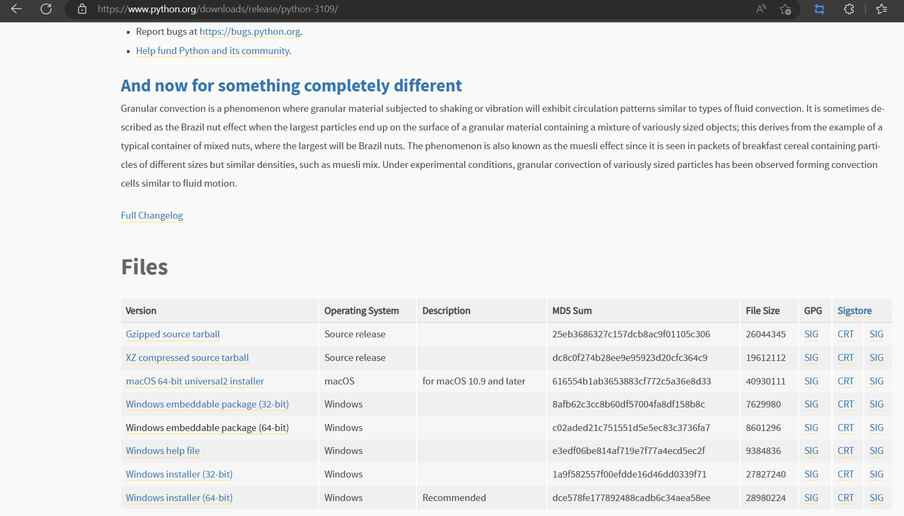
<p>Bấm vào bản cài đặt vừa tải về và bắt đầu cài</p>
  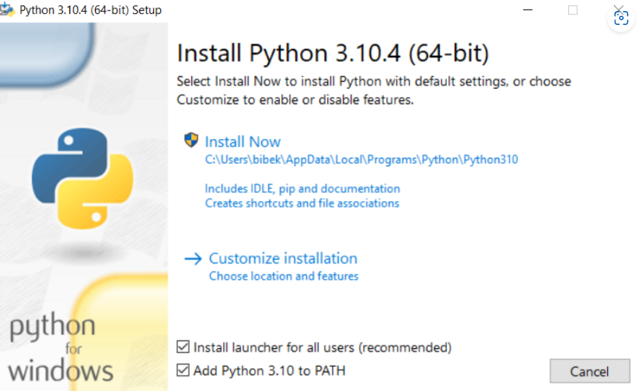
<p>Đảm bảo đánh dấu Add Python 3.10 to PATH nếu không bạn sẽ phải thực hiện điều đó một cách cụ thể. Nó sẽ bắt đầu cài đặt python trên windows.</p> <br />

#### wkhtmltopdf: <a href="https://wkhtmltopdf.org/downloads.html">wkhtmltopdf </a>
<p>Tải bản tương thích với hệ điều hảnh</p>
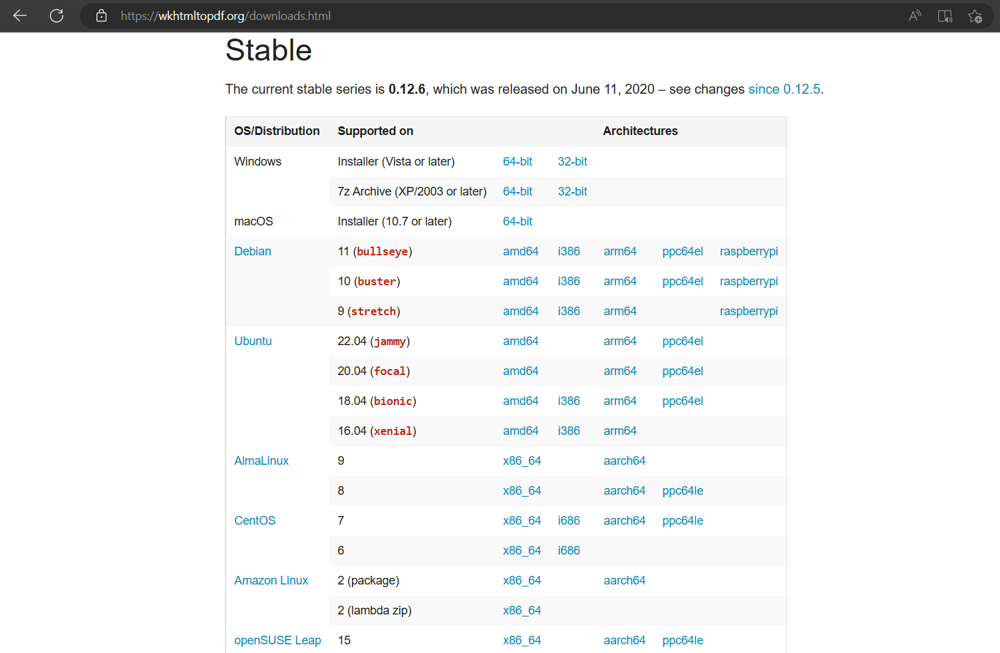
<p>Bấm vào bản cài đặt vừa tải về và bắt đầu cài</p>
<p>Path thư mục bin của wkhtmltopdf vào biến môi trường</p>
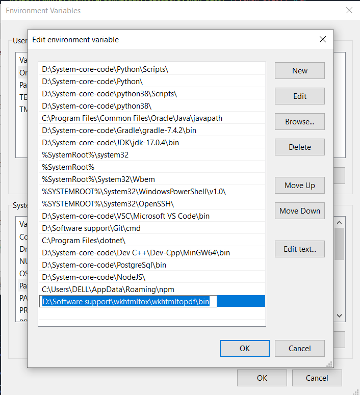


#### XAMPP: <a href="https://www.apachefriends.org/download.html">XAMPP </a><br />
Cách cài đặt XAMPP trên Windows
+ Bước 1: Download XAMPP
+ Bước 2: Nhấp vào file có đuôi .exe trên file tải xuống.
+ Bước 3: Trên cửa sổ Set up, tích chọn các phần mềm mà bạn muốn cài đặt. Nếu bạn muốn cài WordPress trên XAMPP, các phần mềm + bắt buộc phải chọn là MySQL, Apache, PHPMyAdmin. Sau khi chọn xong, nhấn Next.
+ Bước 4: Chọn thư mục cài đặt và nhấn Next.
+ Bước 5: Chờ vài phút để cài đặt, sau khi cài đặt hoàn tất nhấn finish để kết thúc.

Cách cài đặt XAMPP trên Linux
+ Bước 1: Download XAMPP cho Linux.
+ Bước 2: Chọn file xampp-linux-x64-7.2.8-0-installer.run  trong file cài đặt
+ Đầu tiên thêm quyền thực thi cho file cài đặt

Đầu tiên thêm quyền thực thi cho file cài đặt
```sh
cd thu_muc_chua_file_cai_dat/
sudo chmod +x xampp-linux-x64-7.2.8-0-installer.run
```

Chọn cài đặt với quyền sudo.
```sh
sudo ./xampp-linux-x64-7.2.8-0-installer.run
```
Nhấn Next để cài đặt.
+ Bước 3: Trong cửa sổ Set up, tiếp tục nhấn Next tại các cửa sổ hiện ra.
+ Bước 4: Chờ vài phút để cài đặt, sau khi cài đặt hoàn tất nhấn finish để kết thúc.

+ Lưu ý trước khi cài đặt
Một lưu ý cho người dùng trước khi cài đặt XAMPP là phải xóa hết tất cả phần mềm liên quan đến việc làm localhost như PHP, MySQL. Ngoài ra, trong trường hợp máy chủ Windows đã cài đặt IIS, việc cài XAMPP là điều không cần thiết. Không dùng đồng thời các công cụ tạo localhost khác, khuyến khích gỡ cài đặt trước khi cài XAMPP. Trong quá trình sử dụng, các phần mềm tạo Localhost có thể xung đột với nhau.

+ Nếu dùng Skype
Trong trường hợp máy tính của bạn đang cài Skype, bạn mở Skype -> Tools -> Connection Options -> và bỏ chọn phần “Use port 80 and 443…..” rồi nhập chọn một cổng bất kỳ. Nếu không thực hiện thao tác này, XAMPP sẽ không thể chạy được do cổng mạng 80 đã bị Skype sử dụng.

+ Tắt tường lửa
Bên cạnh đó, bạn cũng nên tắt cài đặt tường lửa trên Windows, cũng như tất cả các phần mềm Antivirus khác, vì những phần mềm này có thể sẽ chặn cổng 80 hoặc các ứng dụng web server, khiến cho XAMPP không thể hoạt động.

+ Tắt UAC Windows
Đặc biệt, người dùng cũng nên tắt User Account Control trên Windows trước đi cài đặt XAMPP để tránh bị giới hạn quyền truy cập.

Cách sử dụng XAMPP cho Windows

+ Khởi động localhost
Sau khi cài đặt XAMPP, người dùng truy cập thư mục c:xampp và mở file xampp-panel.exe để hiển thị bảng điều khiển. Sau đó, nhấp vào nút Start của hai ứng dụng Apache và MySQL để khởi động Webserver. Khi 2 ứng dụng này chuyển sang màu xanh, có nghĩa là localhost đã được khởi động.

#### GIT: <a href="https://git-scm.com/">Git</a>

Vào trang web tải Git chọn mục Downloads > Chọn Tải xuống Git phiên bản phù hợp > Mở file Git chọn Run > Chọn Next > Chọn Browse, chọn nơi cài đặt ấn Next > Chọn Next > Chọn vị trí lưu trên Start Menu, lần lượt chọn Next > Chọn Install > Nhấn Finish.

### Cài đặt

1. Mở VS Code mở vào một thư mục trống rồi clone chương trình xuống: 
  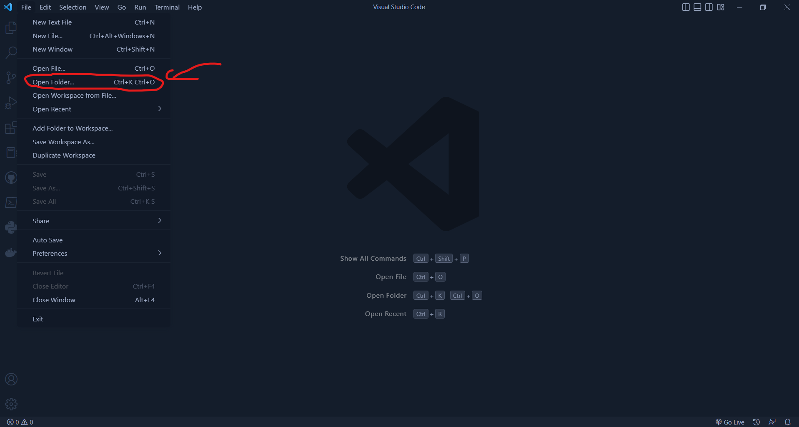

  ```sh
  git clone https://github.com/assassinnyt2811/quanlysinhvien.git
  ```

2. Khởi động localhost trong XAMPP

3. Truy cập vào đường dẫn: `http://localhost:8080/phpmyadmin/`
  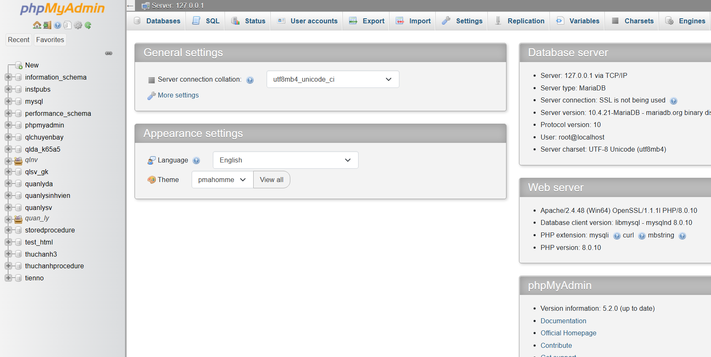

4. Tạo database với tên: `quan_ly_sinh_vien_nhom_1`
  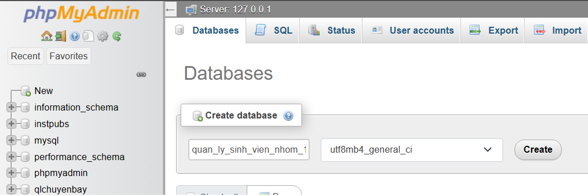

5. Chọn vào database `quan_ly_sinh_vien_nhom_1`
  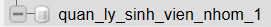

6. Chọn vào import rồi lấy file `qlsv.sql` trong thư mục clone về ở `Bước 1`. Chọn xong thì kéo xuống chọn `Import`
  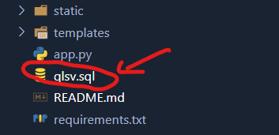
  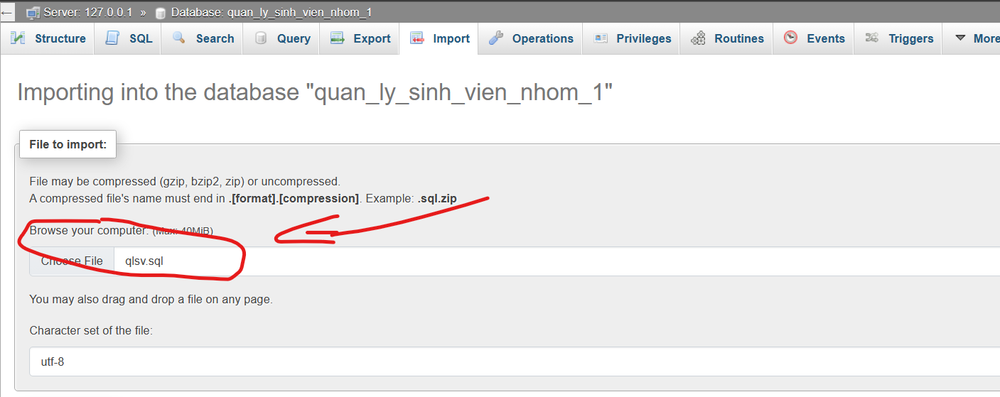

7. Trong Visual Studio Code mở thư mục vừa clone về
  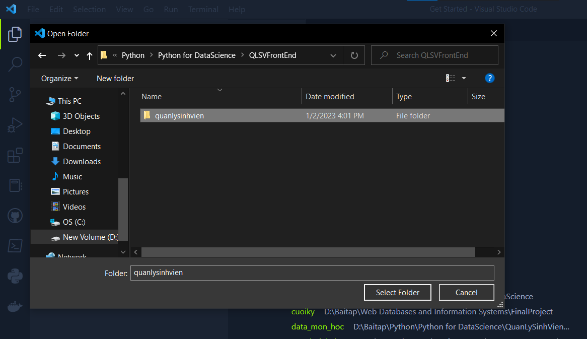

8. Sau đó mở terminal lên dùng tổ hợp phím "Ctrl + `", rồi chạy từng câu lệnh để cài đặt các thư viện cần thiết
  ```sh
  python -m pip install --upgrade pip
  pip install setuptools wheel
  pip install -r requirements.txt
  ```

9. Để bắt đầu chạy ta chạy dòng lệnh `python quan_ly_sinh_vien.py` trong terminal
  ```sh
  python quan_ly_sinh_vien.py
  ```

10. Truy cập trang web: `http://127.0.0.1:5000/login`
    * Tài khoản admin: `1510560001`
    * Mật khẩu: `admin`

    * Tài khoản quản lý mode 2 (Manager 02): `1510560002`
    * Mật khẩu: `12345`

    * Tài khoản sinh viên (D.Nam): `20002076`
    * Mật khẩu: `12345`

11. Bắt đầu sử dụng web

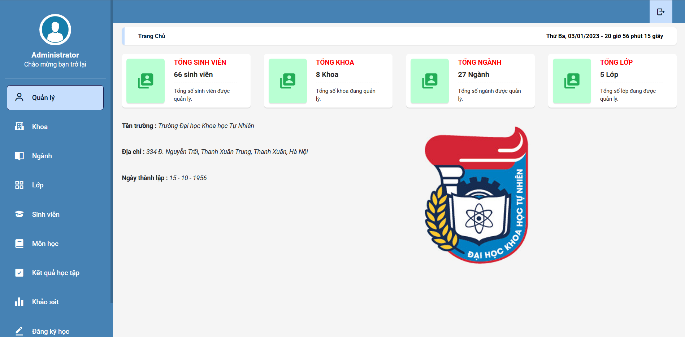

<p align="right">(<a href="#readme-top">Trở lại đầu trang</a>)</p>

## Cách sử dụng

Cách sử dụng: <a href="" >Link PDF báo cáo</a>

<p align="right">(<a href="#readme-top">Trở lại đầu trang</a>)</p>


## Các hướng đi

- [x] Cập nhật, thêm mới hồ sơ nhân sự (nhân viên mới, thay đổi chức vụ).
- [x] Cập nhật, thêm mới các phòng ban hay chi nhánh.
- [x] Chấm công (rõ ràng giờ làm cơ bản, đăng ký làm thêm giờ).
- [x] Xuất bảng lương cá nhân cho mỗi nhân viên và bảng tổng hợp cho quản lý, kế toán.
- [x] Xem chi tiết hồ sơ nhân viên với các tài khoản được cấp quyền.
- [x] Tìm kiếm nhân viên theo một bộ lọc được thiết kế đơn giản.
- [x] Tính lương, thưởng và chế độ cho nhân sự. 
- [ ] Quản lý luân chuyển nhân viên.
- [ ] Quản lý chế độ: Bảo hiểm y tế, bảo hiểm lao động, chế độ nghỉ phép, chế độ nghỉ thai sản, chế độ thưởng, kỷ luật.
- [ ] Có trang giới thiệu cơ cấu nhân sự nội bộ.
- [ ] Có thêm module về quản lý công việc
- [ ] Quản lý thông tin về tuyển dụng nhân sự bổ xung cho doanh nghiệp.

<p align="right">(<a href="#readme-top">Trở lại đầu trang</a>)</p>


## Nhóm

Các thành viên nhóm:
- Lã Đức Nam (Leader)
- Phạm Hồng Nghĩa
- Dương Văn Nam

Nếu có đề xuất nào có thể cải thiện điều này, vui lòng rẽ nhánh repo và tạo yêu cầu Pull. Đừng quên cho dự án một ngôi sao! Cảm ơn!

1. Rẽ nhánh Project

2. Tạo luồng với tính năng mới mà bạn sẽ thêm (`git checkout -b explore/your_feature`)

3. Commit thay đổi của bạn (`git commit -m 'Thêm một vài module hay ho'`)

4. Đẩy lên luồng của bạn (`git push origin explore/your_feature`)

5. Mở một Pull Request


<p align="right">(<a href="#readme-top">Trở lại đầu trang</a>)</p>

## Liên hệ

Lã Đức Nam - [@laducnam](https://www.linkedin.com/in/l%C3%A3-%C4%91%E1%BB%A9c-nam-9b27b4219/) - ducnamla2@gmail.com

Project Link: [https://github.com/assassinnyt2811/quanlysinhvien](https://github.com/assassinnyt2811/quanlysinhvien)

<p align="right">(<a href="#readme-top">Trở lại đầu trang</a>)</p>

## Tài nguyên hữu ích

* [Img Shields](https://shields.io)
* [GitHub Pages](https://pages.github.com)
* [Font Awesome](https://fontawesome.com)
* [React Icons](https://react-icons.github.io/react-icons/search)
* [Box Icons](https://boxicons.com/)
* [Flask Document](https://flask.palletsprojects.com/en/2.2.x/)

<p align="right">(<a href="#readme-top">Trở lại đầu trang</a>)</p>


[stars-shield]: https://img.shields.io/github/stars/assassinnyt2811/quanlysinhvien.svg?style=for-the-badge
[stars-url]: https://github.com/assassinnyt2811/quanlysinhvien/stargazers
[linkedin-shield]: https://img.shields.io/badge/-LinkedIn-black.svg?style=for-the-badge&logo=linkedin&colorB=555
[linkedin-url]: https://www.linkedin.com/in/l%C3%A3-%C4%91%E1%BB%A9c-nam-9b27b4219/
[product-screenshot]: data_img/Product.png
[python]: https://img.shields.io/badge/python-000000?style=for-the-badge&logo=python&logoColor=bue
[Next-url]: https://www.python.org/
[fontawesome]: https://img.shields.io/badge/fontawesome-000000?style=for-the-badge&logo=fontawesome&logoColor=blue
[fontawesome-url]: https://fontawesome.com/
[Bootstrap.com]: https://img.shields.io/badge/Bootstrap-563D7C?style=for-the-badge&logo=bootstrap&logoColor=white
[Bootstrap-url]: https://getbootstrap.com
[JQuery.com]: https://img.shields.io/badge/jQuery-0769AD?style=for-the-badge&logo=jquery&logoColor=white
[JQuery-url]: https://jquery.com 
[boxicons]: https://img.shields.io/badge/boxicons-35495E?style=for-the-badge&logo=boxicons&logoColor=blue
[boxicons-url]: https://boxicons.com/
[Javascript]: https://img.shields.io/badge/javascript-DD0031?style=for-the-badge&logo=javascript&logoColor=blue
[Javascript-url]: https://www.w3schools.com/js/
[HTML5]: https://img.shields.io/badge/html5-4A4A55?style=for-the-badge&logo=html5&logoColor=red
[HTML5-url]: https://www.w3schools.com/html/
[CSS3]: https://img.shields.io/badge/css3-4A4A55?style=for-the-badge&logo=css3&logoColor=pink
[CSS3-url]: https://www.w3schools.com/css/
[MYSQL]: https://img.shields.io/badge/mysql-0769AD?style=for-the-badge&logo=mysql&logoColor=yellow
[MYSQL-url]: https://www.mysql.com/
[flask]: https://img.shields.io/badge/flask-DD0031?style=for-the-badge&logo=flask&logoColor=3C2A21
[flask-url]: https://flask.palletsprojects.com/en/2.2.x/
[VSCode]: https://img.shields.io/badge/vscode-0769AD?style=for-the-badge&logo=visualstudiocode&logoColor=white
[VSCode-url]: https://code.visualstudio.com/
[XAMPP]: https://img.shields.io/badge/XAMPP-orange?style=for-the-badge&logo=xampp&logoColor=white
[XAMPP-url]: https://www.apachefriends.org/download.html
[GIT]: https://img.shields.io/badge/git-black?style=for-the-badge&logo=git&logoColor=white
[GIT-url]: https://git-scm.com/